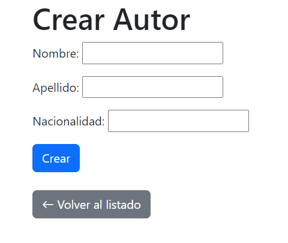

# Biblioteca Alkemy 📚🚀
## Introducción:
Proyecto "WebApp" de Bootcamp Django - Alkemy 2023 basado en el caso de negocio N°2: "Biblioteca App".
## Tabla de contenidos:
- [Autores](#autores👀)
- [Tecnologias](#tecnologias-👨‍💻)
- [Entornos Compatibles](#entornos-compatibles-💻)
- [Instalación](#instalación🤖)
- [Modulos](#modulos-🚨)


## Autores👀
- [Pablo Sandoval](https://github.com/SPablo2191)
- [Ana Mechaca](https://github.com/analidia27)
- [Dario Heredia](https://github.com/deheredia)

## Tecnologias 👨‍💻


## Entornos Compatibles 💻


## Instalación🤖
Para hacer uso del proyecto de manera local es necesario realizar los siguientes pasos:

1) Ingresar los siguiente comandos en consola:

```cmd
python3 -m venv [nombreDelEntornoVirtual]
```

este comando les creara un entorno virtual para para poder importar posteriormente los paquetes ahi.Para activarlo se emplea el siguiente comando:

```cmd
source nombreDelEntornoVirtual/bin/activate
```
NOTA: en caso de trabajar con windows el entorno virtual se genera con scripts para activar el entorno virtual por ende se tiene que acceder de la siguiente forma:
```cmd
nombreDelEntornoVirtual\Scripts\activate.bat
```
y para apagarlo (en ambos casos) es:

```cmd
deactivate
```

2) despues correr el siguiente comando para obtener los paquetes empleados en la API:

```cmd
pip install -r requirements.txt
```

3) Una vez los paquetes fueron instalados con exito, se debe realizar las migraciones:
```cmd
python manage.py migrate
```
4) Crear un superusuario para acceder al modulo admin:
```cmd
python manage.py createsuperuser
```
5) Levantar el servidor:
```cmd
python manage.py runserver
```
6) ¡Listo! ya puede visitar la pagina web en este [enlace](http://127.0.0.1:8000/). 

## Modulos 🚨
- [socios](#socios)
- [empleados](#empleados)
- [autores](#autores)
- [libros](#libros)
- [prestamos_libros](#prestamos-de-libros)
- [admin](#admin)
- [API](#api)
### Socios

| Método | Path | Descripción |
| ------ | -------- | ----------- |
| POST    | [socios/nuevo](#registrar-y-editar-un-socio) | Registrar un nuevo socio |
| GET   | [socios/listado](#listado-de-socios) | Recuperar el listado de socios |
| POST    | [socios/editar/<int:id>](#registrar-y-editar-un-socio) | Editar un socio por su id |
| POST    | [socios/estado/<int:id>](#cambiar-estado-de-socio) | Cambiar el estado de un socio de activo a inactivo o viceversa |

#### **Registrar y Editar un socio**:
Al acceder a esta vista, se da la posilibidad al usuario para registrar un nuevo socio empleando un formulario. En caso de acceder pasando el id de un socio registrado, se carga la información actual de ese socio para poder ser modificada.

**Registrar:**


**Editar:**


**Código:**
```python
def create_update_partner(request, id=None):
    if(id):
        """ Si se envia el id del socio se obtiene el objeto y se crea el formulario con datos, 
        sino se crea el formulario vacio"""
        try: 
            requested_partner = Partner.objects.get(id=id)
            form = PartnerForm(instance=requested_partner) 
        except Exception:
            return render(request, 'error.html')
    else:
        form = PartnerForm()
        
    if request.method == "POST":
        if(id):
            form = PartnerForm(request.POST,instance=requested_partner) 
        else:
            form = PartnerForm(request.POST)
        if form.is_valid():
            form.save()
            return redirect('/socios/listado')

        else:
            return HttpResponseRedirect('create_partner/')
        
    context = {'form': form,'is_update': id != None}
    
    return render(request, 'create_partner.html', context)
```
#### **Listado de socios**:
Al acceder a esta vista se cargan todos los socios (activos como inactivos) en una tabla:


**Código**:
```python
def list_partners(request):

    partners = Partner.objects.all()

    context = {
        'partners' : partners
    }
    
    return render(request, 'list_partners.html', context=context)
```
#### **Cambiar estado de socio**:
 Si el socio esta en estado activo pasa a estar inactivo y viceversa. Se realiza desde la vista de listado por medio de la tabla, tomando el id de ese socio puntualmente.

 
 **Código**:
 ```python
 def change_status_partner(request,id):
    partner = Partner.objects.get(id=id)
    if partner.is_active:
        partner.is_active = False
    else:
        partner.is_active = True
    partner.save()
    return redirect('list_partners') 
 ```

### Empleados

| Método | Path | Descripción |
| ------ | -------- | ----------- |
| POST    | [empleados/nuevo](#registrar-y-editar-un-empleado) | Registrar un nuevo empleado |
| GET   | [empleados/listado](#listado-de-empleado) | Recuperar el listado de empleados |
| POST    | [empleados/editar/<int:id>](#registrar-y-editar-un-empleado) | Editar un empleado por su id |
| POST    | [empleados/estado/<int:id>](#cambiar-estado-de-empleado) | Cambiar el estado de un empleado de activo a inactivo o viceversa |

#### **Registrar y Editar un Empleado**:
Al acceder a esta vista, se da la posilibidad al usuario para registrar un nuevo empleado empleando un formulario. En caso de acceder pasando el id de un empleado registrado, se carga la información actual de ese socio para poder ser modificada.

**Registrar:**


**Editar:**


**Código:**
```python
def create_employee(request,id=None):
    """Si se envia el id del empleado se obtiene el objeto y se crea el formulario con datos, 
        sino se crea el formulario vacio"""
    if(id != None):
        try:
            requested_employed = Employee.objects.get(id=id)
            form = EmployeeForm(instance=requested_employed)         
        except Exception:
            return render(request, 'error.html')
    else:
        form = EmployeeForm()
    if request.method == "POST":

        if(id):
            form = EmployeeForm(request.POST,instance=requested_employed) 
        else:
            form = EmployeeForm(request.POST)
        if form.is_valid():
            form.save()
            return redirect('list_employees')
        else:
            return HttpResponseRedirect('create_employee/')

    context = {'form': form,'is_update':id != None}
    
    return render(request, 'create_employee.html', context)
```
#### **Listado de Empleado**:
Al acceder a esta vista se cargan todos los empleandos (activos como inactivos) en una tabla:


**Código**:
```python
def list_employees(request):

    employees = Employee.objects.all()

    context = {
        'employees' : employees
    }
    
    return render(request, 'list_employees.html', context=context)
```
#### **Cambiar estado de Empleado**:
 Si el empleado esta en estado activo pasa a estar inactivo y viceversa. Se realiza desde la vista de listado por medio de la tabla, tomando el id de ese empleado puntualmente.

 **Código**:
 ```python
 def change_status_employee(request,id):
    employee = Employee.objects.get(id=id)
    if employee.is_active:
        employee.is_active = False
    else:
        employee.is_active = True
    employee.save()
    return redirect('list_employees') 
```

### Autores

| Método | Path | Descripción |
| ------ | -------- | ----------- |
| POST    | [autores/nuevo](#registrar-y-editar-un-autor) | Registrar un nuevo autor |
| GET   | [autores/listado](#listado-de-autor) | Recuperar el listado de autores |
| POST    | [autores/editar/<int:id>](#registrar-y-editar-un-autor) | Editar un autor por su id |
| POST    | [autores/estado/<int:id>](#cambiar-estado-de-autor) | Cambiar el estado de un autor de activo a inactivo o viceversa |

#### **Registrar y Editar un autor**:
Al acceder a esta vista, se da la posilibidad al usuario para registrar un nuevo autor empleando un formulario. En caso de acceder pasando el id de un socio registrado, se carga la información actual de ese socio para poder ser modificada.

**Registrar:**



**Editar:**


**Código:**
```python
def create_update_author(request, id=None):
    if(id):
        """ Si se envia el id del autor se obtiene el objeto y se crea el formulario con datos, 
        sino se crea el formulario vacio"""
        try:
            requested_author = Author.objects.get(id=id)
            form = AuthorForm(instance=requested_author)
        except Exception:
            return render(request, 'error.html') 
    else:
        form = AuthorForm()
        
    if request.method == "POST":
        if(id):
            form = AuthorForm(request.POST,instance=requested_author) 
        else:
            form = AuthorForm(request.POST)
        if form.is_valid():
            form.save()
            return redirect('/autores/listado')

        else:
            return HttpResponseRedirect('create_author/')
        
    context = {'form': form,'is_update': id != None}
    
    return render(request, 'create_author.html', context)

```
#### **Listado de autores**:
Al acceder a esta vista se cargan todos los socios (activos como inactivos) en una tabla:


**Código**:
```python
def list_authors(request):

    authors = Author.objects.all()

    context = {
        'authors' : authors
    }
    
    return render(request, 'list_authors.html', context=context)

```
#### **Cambiar estado de autor**:
 Si el autor esta en estado activo pasa a estar inactivo y viceversa. Se realiza desde la vista de listado por medio de la tabla, tomando el id de ese autor puntualmente.

 
 **Código**:
 ```python
def change_status_author(request,id):
    author = Author.objects.get(id=id)
    if author.is_active:
        author.is_active = False
    else:
        author.is_active = True
    author.save()
    return redirect('list_authors') 
 ```

 ### Libros

| Método | Path | Descripción |
| ------ | -------- | ----------- |
| POST    | [libros/nuevo](#registrar-y-editar-un-libro) | Registrar un nuevo libro |
| GET   | [libros/listado](#listado-de-libro) | Recuperar el listado de libros |
| POST    | [libros/editar/<int:id>](#registrar-y-editar-un-libro) | Editar un libro por su id |
| POST    | [libros/estado/<int:id>](#cambiar-estado-de-libro) | Cambiar el estado de un libro de activo a inactivo o viceversa |

#### **Registrar y Editar un libro**:
Al acceder a esta vista, se da la posilibidad al usuario para registrar un nuevo libro empleando un formulario. En caso de acceder pasando el id de un libro registrado, se carga la información actual de ese libro para poder ser modificada.

**Registrar:**


**Editar:**


**Código:**
```python
def create_update_book(request, id=None):
    if id:
        """ Si se envia el id del libro se obtiene el objeto y se crea el formulario con datos, 
        sino se crea el formulario vacio"""
        try:
            requested_book = Book.objects.get(id=id)
            form = BookForm(instance=requested_book) 
        except Exception:
            return render(request, 'error.html')
    else:
        form = BookForm()
        
    if request.method == "POST":
        if id:
            form = BookForm(request.POST,instance=requested_book) 
        else:
            form = BookForm(request.POST)
        if form.is_valid():
            form.save()
            return redirect('/libros/listado')

        else:
            return HttpResponseRedirect('create_book/')
        
    context = {'form': form,'is_update': id != None}
    
    return render(request, 'create_book.html', context)


```
#### **Listado de libros**:
Al acceder a esta vista se cargan todos los libros (activos como inactivos) en una tabla:


**Código**:
```python
def list_books(request):

    books = Book.objects.all()

    context = {
        'books' : books
    }
    
    return render(request, 'list_books.html', context=context)

```
#### **Cambiar estado de libro**:
 Si el libro esta en estado activo pasa a estar inactivo y viceversa. Se realiza desde la vista de listado por medio de la tabla, tomando el id de ese libro puntualmente.

 
 **Código**:
 ```python
def change_status_book(request,id):
    book = Book.objects.get(id=id)
    if book.active:
        book.active = False
    else:
        book.active = True
    book.save()
    return redirect('list_books')  
 ``` 
### Libros

| Método | Path | Descripción |
| ------ | -------- | ----------- |
| POST    | [libros/nuevo](#registrar-y-editar-un-libro) | Registrar un nuevo libro |
| GET   | [libros/listado](#listado-de-libro) | Recuperar el listado de libros |
| POST    | [libros/editar/<int:id>](#registrar-y-editar-un-libro) | Editar un libro por su id |
| POST    | [libros/estado/<int:id>](#cambiar-estado-de-libro) | Cambiar el estado de un libro de activo a inactivo o viceversa |

#### **Registrar y Editar un libro**:
Al acceder a esta vista, se da la posilibidad al usuario para registrar un nuevo libro empleando un formulario. En caso de acceder pasando el id de un libro registrado, se carga la información actual de ese libro para poder ser modificada.

**Registrar:**


**Editar:**


**Código:**
```python
def create_update_book(request, id=None):
    if id:
        """ Si se envia el id del libro se obtiene el objeto y se crea el formulario con datos, 
        sino se crea el formulario vacio"""
        try:
            requested_book = Book.objects.get(id=id)
            form = BookForm(instance=requested_book) 
        except Exception:
            return render(request, 'error.html')
    else:
        form = BookForm()
        
    if request.method == "POST":
        if id:
            form = BookForm(request.POST,instance=requested_book) 
        else:
            form = BookForm(request.POST)
        if form.is_valid():
            form.save()
            return redirect('/libros/listado')

        else:
            return HttpResponseRedirect('create_book/')
        
    context = {'form': form,'is_update': id != None}
    
    return render(request, 'create_book.html', context)


```
#### **Listado de libros**:
Al acceder a esta vista se cargan todos los libros (activos como inactivos) en una tabla:


**Código**:
```python
def list_books(request):

    books = Book.objects.all()

    context = {
        'books' : books
    }
    
    return render(request, 'list_books.html', context=context)

```
#### **Cambiar estado de libro**:
 Si el libro esta en estado activo pasa a estar inactivo y viceversa. Se realiza desde la vista de listado por medio de la tabla, tomando el id de ese libro puntualmente.

 
 **Código**:
 ```python
def change_status_book(request,id):
    book = Book.objects.get(id=id)
    if book.active:
        book.active = False
    else:
        book.active = True
    book.save()
    return redirect('list_books')  
 ```

### Prestamos de Libros

| Método | Path | Descripción |
| ------ | -------- | ----------- |
| POST    | [prestamos_libros/nuevo](#registrar-y-editar-un-prestamo-libro) | Registrar un nuevo prestamo de libro |
| GET   | [prestamos_libros/listado](#listado-de-prestamo-libro) | Recuperar el listado de prestamos de libros |
| POST    | [prestamos_libros/editar/<int:id>](#registrar-y-editar-un-prestamo-libro) | Editar un prestamo de libro por su id |
| POST    | [prestamos_libros/eliminar/<int:id>](#eliminar-un-prestamo-libro) | Eliminar un prestamo de libro |

#### **Registrar y Editar un Prestamo de Libro**:
Al acceder a esta vista, se da la posilibidad al usuario para registrar un nuevo prestamo de libro empleando un formulario. En caso de acceder pasando el id de un prestamo de libro registrado, se carga la información actual de ese prestamo para poder ser modificada.

**Registrar:**


**Editar:**


**Código:**
```python
def create_update_loan(request, id=None):
    if(id):
        """ Si se envia el id del libro se obtiene el objeto y se crea el formulario con datos, 
        sino se crea el formulario vacio"""
        try:
            requested_book_loan = BookLoan.objects.get(id=id)
            form = BookLoanForm(instance=requested_book_loan) 
        except Exception:
            return render(request, 'error.html')
    else:
        form = BookLoanForm()
        
    if request.method == "POST":
        if(id):
            form = BookLoanForm(request.POST,instance=requested_book_loan) 
        else:
            form = BookLoanForm(request.POST)
        if form.is_valid():
            form.save()
            return redirect('/prestamos_libros/listado')

        else:
            return HttpResponseRedirect('create_book_loan/')
        
    context = {'form': form,'is_update': id != None}
    
    return render(request, 'create_book_loan.html', context)
```
#### **Listado de Prestamo de Libro**:
Al acceder a esta vista se cargan todos los prestamo de libro en una tabla:


**Código**:
```python
def list_book_loans(request):

    book_loans = BookLoan.objects.all()

    context = {
        'book_loans' : book_loans
    }
    
    return render(request, 'list_book_loans.html', context=context)
```
#### **Eliminar un prestamo de libro**:
 Se eliminara un registro de un prestamo de un libro al acceder al boton eliminar, luego de confirmar:

 
 
 **Código**:
 ```python
def delete_book_loan(request,id):
    try:
        book_loan = BookLoan.objects.get(id=id)
        if request.method == 'POST':
            book_loan.delete()
            return redirect('/prestamos_libros/listado')
        context = {
            'book_loan': book_loan
        }
        return render(request, 'delete_book_loan.html', context)
    except Exception:
        return render(request, 'error.html')
 
 ```

### Admin
El el archivo admin.py se deben realizar importaciones del módulo admin y los modelos creados previamente de la aplicación biblioteca:
```python
from django.contrib import admin
from .models import Book, BookLoan, Author, Employee, Partner
```
Se crean clases admin basadas en modelos para ser administradas con un usuario con acceso.
Para cada modelo se pueden definir los atributos de clase visibles, filtros y campos de busqueda por atributos especificos.
Los modelos disponibles deben agregarse para que sen visibles:

**Código:**
```python
admin.site.register(Book, BookAdmin)
admin.site.register(BookLoan, BookLoanAdmin)
admin.site.register(Author, AuthorAdmin)
admin.site.register(Employee, EmployeeAdmin)
admin.site.register(Partner, PartnerAdmin)
```
#### **Admin autores**:
Administrador de autores, permite agregar, editar y eliminar registros.

 

**Código:**
```python
class AuthorAdmin(admin.ModelAdmin):
    # Lista de atributos visibles
    list_display = (
        "name",
        "surname",
        "nationality",
        "is_active",
    )
    #Filtro para mostrar autor activos o por nacionalidades
    list_filter = ("is_active", "nationality")
    #Buscador por nombre o apellido de autor
    search_fields = (
        "name", 
        "surname",
    )
```
#### **Admin empleados**:
Administrador de empleados, permite agregar, editar y eliminar registros.

 
**Código:**
```python
class EmployeeAdmin(admin.ModelAdmin):
    # Lista de atributos visibles    
    list_display = (
        "name",
        "surname",
        "numero_legajo",
        "is_active",
    )
    #Filtro para mostrar solo empleados activos
    list_filter = ("is_active",)
    #Buscador por nombre o apellido de empleado
    search_fields = (
        "name",
        "surname",
    )
```
 #### **Admin socios**:
Administrador de socios, permite agregar, editar y eliminar registros.

 
**Código:**
```python
class PartnerAdmin(admin.ModelAdmin):
    # Lista de atributos visibles
    list_display = (
        "first_name",
        "last_name",
        "date_birth",
        "is_active",
    )
    #Filtro para mostrar solo socios activos
    list_filter = ("is_active",)
    #Buscador por nombre o apellido de socio
    search_fields = (
        "first_name",
        "last_name",
    )
```
 ### API
 | Método | Endpoint | Descripción |
| ------ | -------- | ----------- |
| GET   | [api/libros](#listado-de-libros) | Recuperar todos los libros registrados |
| GET   | [api/libros/<int:id>](#socio-registro) | Recuperar un libro por su ID |
| GET   | [api/socios](#socio-registro) | Recuperar todos los socios registrados |
| GET   | [api/empleados](#listado-de-empleados) | Recuperar todos los empleados recuperados
| GET   | [api/autores](#listado-de-autores) | Recuperar todos los autores registrados |
#### **Listado de libros**:
Se recupera el listado de libros y se retorna en formato JSON.

 

**Código:**
```python
def list_books_json(request):
    books = Book.objects.all().values('id', 'title','author')
    if(books):
        list_books = list()
        for book in books:  
            item = list(book.values())
            temp_book = {}
            temp_book['id'] = item[0]
            temp_book['titulo'] = item[1]
            temp_book['autor'] = str(Author.objects.get(id=item[2]))
            list_books.append(temp_book)

    else:
        list_books = list()
    data = {
        'libros': list_books
    }
    return HttpResponse(json.dumps(data, ensure_ascii=False).encode('utf-8'), content_type="application/json") 
```
#### **Libro por su ID**:
Se recupera un libro por su ID y se retorna en formato JSON. En caso de no existir se retorna un array vacio.


**Código:**
```python
def book_json(request, id):

    if request.method == 'GET':
        try:

            book = Book.objects.get(id = id)

            data = {
                'Libro': {
                    'id' : id,
                    'titulo' : book.title,
                    'descripcion' : book.description,
                    'autor' : str(book.author)
                    }
            }

            return JsonResponse(data)
        
        except:
            msj = {
                'Libro' : []
                }

            return JsonResponse(msj)
```
#### **Listado de empleados**:
Se recupera el listado de socios y se retorna en formato JSON.


**Código:**
```python
def list_partner_json(request):
    partners = Partner.objects.all().values('id', 'first_name','last_name','date_birth','is_active')
    if(partners):
        list_partners = list()
        for partner in partners:  
            item = list(partner.values())
            temp_partner = {}
            temp_partner['id'] = item[0]
            temp_partner['first_name'] = item[1]
            temp_partner['last_name'] = item[2]
            temp_partner['date_birth'] = str(item[3])
            temp_partner['is_active'] = item[4]
            list_partners.append(temp_partner)

    else:
        list_partners = list()
    data = {
        'socios': list_partners
    }
    return HttpResponse(json.dumps(data, ensure_ascii=False).encode('utf-8'), content_type="application/json")

```

#### **Listado de empleados**:
Se recupera el listado de empleados y se retorna en formato JSON.


**Código:**
```python
def list_employee_json(request):
    employees = Employee.objects.all()
    if employees:
        list_employees = list()
        for employee in employees:
            list_employees.append(employee.__dict__())

    else:
        list_employees = list()
    data = {
        'empleados': list_employees
    }
    return HttpResponse(json.dumps(data, ensure_ascii=False).encode('utf-8'), content_type="application/json")
```
#### **Listado de autores**:
Se recupera el listado de empleados y se retorna en formato JSON.


**Código:**
```python
def list_author_json(request):
    authors = Author.objects.all().values(
        "id", "name", "surname", "nationality", "is_active"
    )
    if authors:
        list_authors = list()
        for author in authors:
            item = list(author.values())
            temp_author = {}
            temp_author["id"] = item[0]
            temp_author["nombre"] = item[1]
            temp_author["apellido"] = item[2]
            temp_author["nacionalidad"] = item[3]
            temp_author["activo"] = item[4]
            list_authors.append(temp_author)

    else:
        list_authors = list()
    data = {"autores": list_authors}
    return HttpResponse(
        json.dumps(data, ensure_ascii=False).encode("utf-8"),
        content_type="application/json",
    )
```